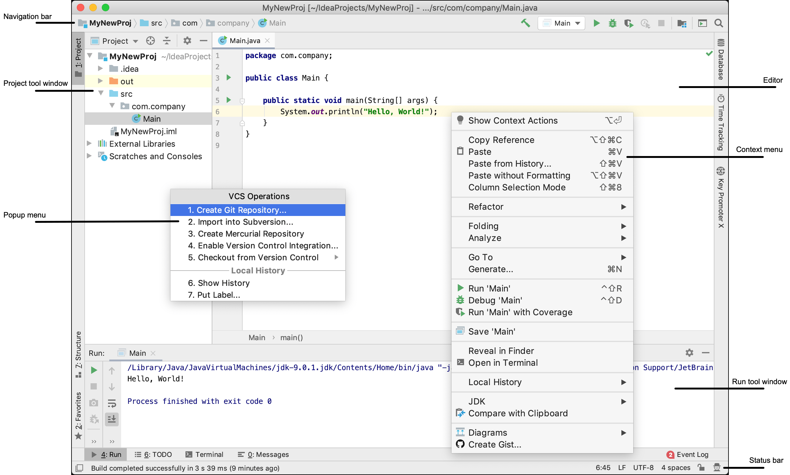

[Top](../../README.md)

# Navigate the IDE

## Exercises
* Toggle the IDE to fullscreen
* Toggle the editor tab to fullscreen
* Toggle 'Presentation Mode'
* Toggle 'Distraction Free Mode'
* Open a file using the Navigation Bar
* Open a file using the Switcher
* Switch between 2 Editor Tabs without using the Switcher/Navigation Bar
* Open the Terminal Window using the Switcher

[Mac OS X Shortcuts](osx.md)  
[Windows/Linux Shortcuts](windows.md)  